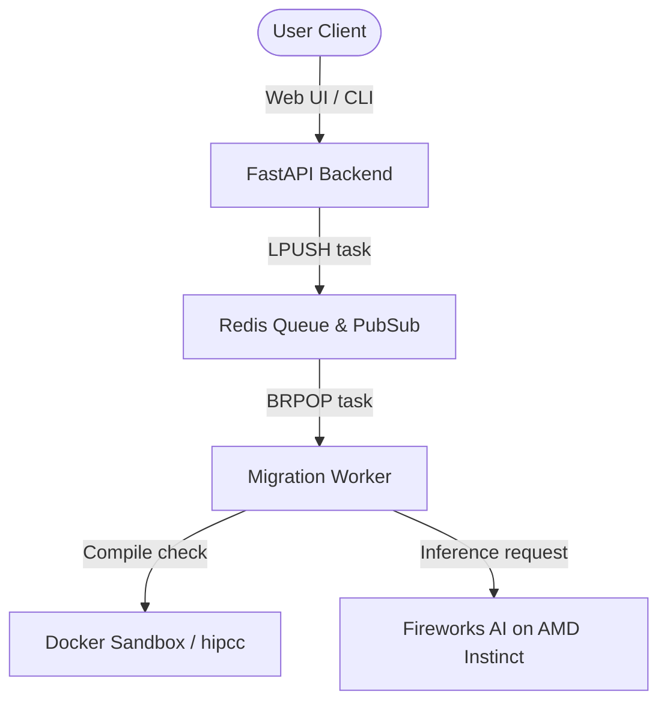

# 🚀 HIPForge: AI-Orchestrated CUDA → AMD HIP Migration

HIPForge is a self-healing, AI-orchestrated migration platform that automates the translation, compilation validation, and error-repair of Nvidia CUDA GPU code into AMD HIP/ROCm code.

By combining deterministic translators (`hipify-clang`, `hipcc`) with specialized LLM agents (Analysis, Patch, and Research) running on AMD Instinct GPU hardware, HIPForge automates the "last 30%" of migration debugging that standard compile-time translation tools leave behind.

> [!NOTE]
> **v0 Focus — Compile-Validation Only**
>
> HIPForge v0 validates that translated HIP code **compiles successfully** against target AMD GPU architectures (e.g. `gfx90a`, `gfx942`).
> Runtime execution on physical GPU hardware is a future validation tier and is **not** run or claimed by default.

---

## 📚 Technical Documentation Directory

For deeper implementation details, consult the following specialized docs:

* **[FRESH_MACHINE_RUNBOOK](docs/FRESH_MACHINE_RUNBOOK.md)**: Standard setup runbook: clone -> Docker Compose up -> health check -> run migration.
* **[README_DEMO](README_DEMO.md)**: Guide to demonstrating the state machine, explaining reports, and avoiding mock confusion.
* **[DEPENDENCIES](docs/DEPENDENCIES.md)**: Full list of runtime environment variables, compilers, and sandbox components.
* **[MOCK_VS_REAL](docs/MOCK_VS_REAL.md)**: Configuration toggles, testing practices, and guidelines for mock vs real modes.
* **[AMD_COMPUTE_USAGE](docs/AMD_COMPUTE_USAGE.md)**: Information regarding Fireworks AI integration on AMD Instinct hardware and CDNA target compilation.
* **[SYSTEM_ARCHITECTURE](docs/ARCHITECTURE.md)**: Summary of the thin-client architecture, task broker, and compilation sandbox.
* **[WORKFLOW_LIFECYCLE](docs/WORKFLOW.md)**: Walkthrough of the processing stages, size limits, and event reporting.

---

## ⚡ v0 Core Capabilities

* **Deterministic HIPify Translation**: Runs `hipify-clang` recursively, copies auxiliary assets, and translates compiler references (`nvcc` -> `hipcc`) inside Makefiles and build scripts.
* **Secondary AST Search-and-Replace**: Scans generated files for remaining CUDA calls and applies deterministic API translations (e.g. `cudaMalloc` -> `hipMalloc`).
* **Semantic Compatibility Analysis (SCA)**: Inspects files for semantic migration risks (e.g. warp size assumptions or texture references) and outputs a structured diagnostic file (`migration_risks.json`).
* **AI-Assisted Self-Healing**: Extracts compilation errors and code slices, routing them through LLM agents to suggest code patches.
* **Launcher Hardening**: Hardens generated launch functions by automatically inserting nullptr pointer checks, `N <= 0` size guards, and `hipGetLastError()` launch checks.
* **File Lifecycle Tracking**: Monitors files individually, recording conversion status, hashes, and compile results (`PASSED`/`FAILED`/`SKIPPED`/`NOT_RUN`).
* **WebSocket Timeline Stream**: Publishes logs and lifecycle status updates to Redis, streaming them in real-time to Web browser terminals and CLI consoles.
* **Structured Package Export**: Packs translated source files, Git diff patches, compile logs, and JSON metrics into a downloadable archive (`HIPForge_Migration.zip`).

---

## 🏗️ Thin-Client Architecture

HIPForge separates user interfaces from heavy compilation workloads:



* **Thin Clients (Web, CLI, API)**: Accept input and project files. They do not run compiler tools or call AI models locally.
* **FastAPI Backend**: Manages workspace directory storage on the host filesystem and enqueues jobs into Redis.
* **Redis Queue & PubSub**: Relays tasks to workers and relays progress events back to client WebSockets.
* **Migration Worker**: Runs the state machine loop, instantiating a temporary in-memory **Workflow Context** for each task.
* **Sandboxed Compiler**: Mounts files into a secure container running the AMD ROCm SDK.
* **Fireworks AI**: Serves LLM agent queries on **AMD Instinct™ GPU infrastructure** (MI300X accelerators).

---

## ⚡ Quick Start (Docker Compose)

The entire application runs inside container networks; no host Python or Node setup is required.

### 1. Clone the Codebase
Note that paths are case-sensitive on Linux; use the actual folder name `Hipforge` from the clone.

```bash
git clone https://github.com/TMXDev/Hipforge.git
cd HIPForge
```

### 2. Configure the Environment
Copy the example environment template:

```bash
cp .env.example .env             # Windows PowerShell: Copy-Item .env.example .env
```

Set the execution modes in `.env`:
* **Mock Mode (Simulation)**:
  Set `USE_MOCK_COMPILER=true` and `USE_MOCK_AI=true`. No API key or local compiler toolchain required.
* **Real Mode (Validated compilation & AI repair)**:
  Set `USE_MOCK_COMPILER=false` and `USE_MOCK_AI=false`. Requires a valid `FIREWORKS_API_KEY`.

### 3. Start the Stack
Spin up the backend, worker, Next.js frontend, and Redis services:

```bash
docker compose up --build -d
```

Confirm that the containers are healthy:
```bash
docker compose ps
```

### 4. Verify Health Status
Check backend API diagnostics:

```bash
curl http://localhost:8000/api/v1/health/check
```
*Expected Output*: `{"status":"ok","redis":"connected","version":"0.1.0"}`

### 5. Access Interfaces
* **Frontend Web Dashboard**: [http://localhost:3000](http://localhost:3000)
* **Interactive API Swagger Docs**: [http://localhost:8000/docs](http://localhost:8000/docs)

---

## 🔧 Environment Configuration

Core settings available in `.env`:

| Key | Default | Purpose |
| :--- | :--- | :--- |
| `USE_MOCK_COMPILER` | `true` | Runs simulated compilation checks. Set to `false` for real sandbox compiling. |
| `USE_MOCK_AI` | `true` | Simulates LLM agent responses. Set to `false` for live Fireworks AI repairs. |
| `FIREWORKS_API_KEY` | `CHANGE_ME` | API key required when `USE_MOCK_AI=false`. |
| `RUNTIME_VALIDATION_ENABLED`| `false` | Disabled by default. Runtime validation is not run/claimed in v0. |
| `TIMEOUT_COMPILE` | `60` | Compile validation execution timeout. |
| `MAX_CUDA_FILES_FOR_AUTO_MIGRATION` | `20` | Preflight guard: max CUDA source files limit. |
| `MAX_EXTRACTED_BYTES_FOR_AUTO_MIGRATION` | `52428800` | Preflight guard: max ZIP extraction size (50MB). |

---

## ⚠️ Size Limits & Guidelines

> [!WARNING]
> **No Large Monorepo Uploads**
>
> HIPForge enforces strict project size limits to ensure fast execution and prevent container crashes.
> * Files: Max 20 CUDA files, 1000 total files.
> * Size: Max 50 MB extracted, 100 MB archive size.
>
> **Do not upload the entire Nvidia `cuda-samples` repository.** Instead, extract the samples locally and upload one sub-folder (e.g. `vectorAdd`) at a time.

---

## 💻 CLI Usage

The CLI tool is located at `cli/hipforge.py`. Run it inside the backend container or via your local venv.

```bash
# Print help and exit (no-args behaviour)
python cli/hipforge.py

# Check backend server health (default: queries the running backend)
docker compose exec backend python cli/hipforge.py doctor

# Check local machine toolchain instead (hipcc, hipify-clang, Redis on this host)
docker compose exec backend python cli/hipforge.py doctor --local

# Submit a migration job
docker compose exec backend python cli/hipforge.py migrate workspace/input/kernel.cu \
  --output workspace/demo_out --arch gfx942 --attempts 0

# List previous migration history (newest first)
docker compose exec backend python cli/hipforge.py history --limit 10

# Inspect detail of a specific migration by ID
docker compose exec backend python cli/hipforge.py history --id <job_id>

# Launch the interactive shell explicitly
python cli/hipforge.py shell
```

`doctor` always queries the **backend** by default, so it reflects remote/Docker toolchain truth.
Use `--local` only when you want to verify the machine running the CLI itself.

---

## 🧪 Testing Commands

### Unit Tests (Offline)
```bash
# Windows
$env:PYTHONPATH="backend;."
python -m pytest tests/ -q
```

### E2E Integration Tests (Requires running Docker Compose stack)
```bash
$env:PYTHONPATH="backend;."
python -m pytest -m e2e_real -s -vv
```

---

## 🔍 Troubleshooting

| Symptom | Resolution |
| :--- | :--- |
| Backend API unreachable | Check startup outputs: `docker compose logs backend`. |
| Task stays in `QUEUED` status | Verify background worker status: `docker compose logs migration-worker`. |
| Redis Connection Refused | Check Redis logs: `docker compose logs redis`. |
| Upload Aborted | If the run reports `PROJECT_TOO_LARGE`, split the files and upload one sample directory at a time. |
| Sandbox tools not found | Build the sandbox image: `docker build -t hipforge-sandbox:latest -f Dockerfile.sandbox .`. |

---

## 🛑 Shutdown

Stop services and preserve data volumes:
```bash
docker compose down
```

Wipe all local caching and database volumes:
```bash
docker compose down --volumes
```
