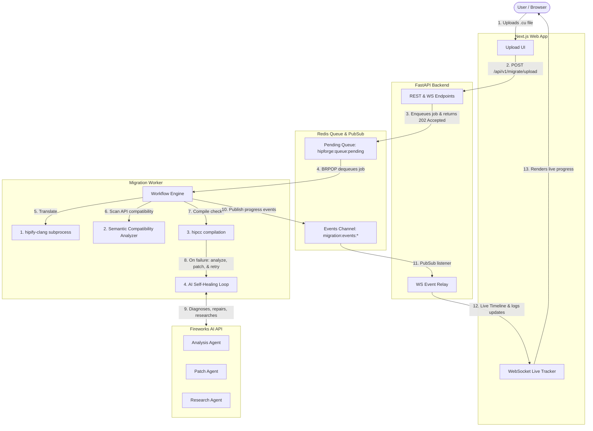

# 🚀 HIPForge: AI-Powered CUDA to ROCm Migration Platform

HIPForge is a self-healing, AI-orchestrated migration assistant built to automate the translation, compilation, and error-repair of NVIDIA CUDA GPU code to AMD HIP/ROCm code.

With a FastAPI backend, a Next.js frontend, a Redis queue/PubSub system, and specialized Fireworks AI agents, HIPForge automates the "last 30%" of migration debugging that standard compile-time translation tools (`hipify-clang`) leave behind.

> [!IMPORTANT]
> **Dependencies**: See [DEPENDENCIES.md](file:///C:/Users/Yassi/Downloads/HIPForge/docs/DEPENDENCIES.md) for full installation and environment requirements.
> By default, `v0` supports compile-validated migration. AMD GPU runtime validation is optional/future and disabled by default.

---

## 🏗️ System Architecture

The following diagram illustrates the flow of jobs and communication channels within HIPForge:



---

## 🛠️ Job States

Every migration travels through exactly these states in order, broadcasting progress in real time:

$$\text{QUEUED} \rightarrow \text{PREPARING} \rightarrow \text{PREFLIGHT} \rightarrow \text{HIPIFY} \rightarrow \text{SCA} \rightarrow \text{COMPILING} \rightarrow \text{ANALYZING} \rightarrow \text{PATCHING} \rightarrow \text{RESEARCHING} \rightarrow \text{COMPILING (retry)} \rightarrow \text{GENERATING\_REPORT} \rightarrow \text{COMPLETED / FAILED}$$

*   **QUEUED**: Job is created and waiting in the Redis list.
*   **PREPARING**: Directory structure is generated under `workspace/YYYY/MM/migration_id/` and uploaded ZIPs are extracted.
*   **PREFLIGHT**: Docker, sandbox, toolchain, Fireworks, workspace, cache, and disk checks run before migration tools launch.
*   **HIPIFY**: Running `hipify-clang` to deterministically translate CUDA calls to HIP.
*   **SCA**: Semantic Compatibility Analyzer scans for deep architectural differences.
*   **COMPILING**: `hipcc` compiles the source file. If successful, skips to report generation.
*   **ANALYZING**: Fireworks AI **Analysis Agent** diagnoses compiler error diagnostics.
*   **PATCHING**: Fireworks AI **Patch Agent** writes and applies source code repairs.
*   **RESEARCHING**: Fireworks AI **Research Agent** looks up ROCm documentation if budget is exhausted.
*   **GENERATING_REPORT**: Package creator produces Markdown/JSON reports, Git diffs, and output ZIP.
*   **COMPLETED / FAILED**: Terminal states. All outputs are cleaned up except reports & ZIP archives.

---

## 💡 Architecture & Compilation Engine (v0)

### Thin Client Backend Integration
HIPForge integrates CLI, Web/API upload, and paste-code interfaces as thin clients that dispatch jobs to the same centralized backend workflow engine, guaranteeing consistent translation, compilation, and self-healing behaviors regardless of input method.

### Direct Redis Architecture
Following a safe cleanup, the system uses direct asynchronous communication with `redis_client` (defined in `app.redis.client`) rather than intermediate wrapper modules, reducing overhead and improving lifecycle performance.

### Build System & Makefile Logic
- **Makefile Fallback**: If no build system is detected in the uploaded files, HIPForge automatically generates a fallback Makefile located at `workspace/generated/Makefile.hipforge`.
- **User Makefiles Protection**: Any user-uploaded Makefile or build configuration is strictly preserved and never overwritten.
- **Multi-File Entrypoint Support**: When no build system exists but multiple files are uploaded, HIPForge detects a valid entrypoint (like a `main` function) to compile the collection together.

### v0 Validation Confidence Levels
By default, AMD GPU runtime validation is disabled (`compile-validated`). Validation confidence levels are computed as follows:
*   **LOW**: `hipify-clang` translation completed, but the `hipcc` compilation failed.
*   **MEDIUM**: Translation and `hipcc` compilation passed successfully, but AMD GPU runtime execution was not performed.
*   **HIGH**: Compilation passed, and runtime validation succeeded on AMD GPU hardware (optional/future).
*   **PROFILED**: Runtime validation passed, and compute efficiency profiling data (`rocprof`) was collected.

### Complete Engineering Reports
Migration reports generated under `workspace/.../reports/` include:
*   **Project Inventory**: Scanned sources and dependency detection.
*   **Build-System Decision**: The chosen compilation strategy.
*   **Compile Command**: The exact command executed by the compiler sandbox.
*   **Validation Confidence**: LOW / MEDIUM / HIGH / PROFILED classification.
*   **Main Error**: Filtered fatal error message from the compiler (prioritized over minor warnings).
*   **Failed Stage**: The pipeline stage where failure occurred (if any).
*   **Recommended Next Action**: Actionable step for the user.
*   **Skipped AI Repair Reason**: Description of why AI repair was skipped.

### Dependency Hardening & AI Repair Policies
If compilation fails due to missing symbols, headers, libraries, or linker errors, it is classified as a `DEPENDENCY_ERROR`. To prevent wasting tokens, the Workflow Engine immediately skips the AI self-healing loop and reports a clear recommended action (e.g. uploading missing files or configuring dependencies).

---

## ⚙️ Configuration & Environment

The application configuration is managed via a `.env` file at the project root.

### Core Variables
*   `REDIS_URL`: The Redis connection string (e.g., `redis://localhost:6379`).
*   `WORKSPACE_PATH`: Storage folder path (default: `workspace`).
*   `WORKSPACE_SIZE_LIMIT`: Max upload file size (default: `100MB`).
*   `DEFAULT_RETRY_BUDGET`: Max repair loops allowed (default: `5`).
*   `LOG_LEVEL`: Logging verbosity (`DEBUG`, `INFO`, `WARNING`, `ERROR`).
*   `NEXT_PUBLIC_BACKEND_URL`: public URL of the FastAPI backend.

### Real vs. Mock Mode (Pre-Hackathon Toggles)
*   `USE_MOCK_AI`: Set to `true` to run the AI Agents with a deterministic local simulation, or `false` to connect to the live Fireworks AI API.
*   `USE_MOCK_COMPILER`: Set to `true` to mock compiler subprocesses, or `false` to execute real `hipify-clang` / `hipcc` binaries locally.
*   `FIREWORKS_API_KEY`: Your Fireworks AI developer platform API key (required when `USE_MOCK_AI=false`).
*   `FIREWORKS_MODEL`: Fireworks model ID used by the AI agents.
*   `HIPFORGE_SANDBOX_IMAGE`: Docker image used for sandboxed compiler execution (default: `rocm/dev-ubuntu-22.04`).
*   `ALLOW_RUNSC_FALLBACK`: Whether Docker may fall back to its default runtime when `runsc` is unavailable (default: `true`).
*   `REQUIRE_HOST_HIPIFY`: Require host `hipify-clang` instead of relying on sandbox fallback.
*   `REQUIRE_NINJA`: Require Ninja even when the uploaded project does not include `build.ninja`.
*   `HIPFORGE_MIN_FREE_DISK_BYTES`: Minimum free disk threshold checked by pre-flight diagnostics.

---

## 🛠️ Required & Optional Dependencies

For a complete and detailed breakdown of requirements for mock mode, compile-validated mode, AMD GPU runtime execution, and environment variables, please refer to the dedicated [DEPENDENCIES.md](file:///C:/Users/Yassi/Downloads/HIPForge/docs/DEPENDENCIES.md) guide.

---

## Installation Verification

Run diagnostics before the first migration:

```bash
hipforge doctor
```

Run the official install self-test:

```bash
hipforge self-test
```

The self-test creates a temporary CUDA project, runs HIPIFY, compiles with HIPCC, verifies that an output binary was produced, and deletes temporary files.

The web UI exposes the same checks at:

```text
http://localhost:3000/health
```

The backend JSON endpoints are:

```text
GET  /api/v1/health/check
GET  /api/v1/doctor
POST /api/v1/self-test
```

---

## Running `hipforge doctor`

`hipforge doctor` executes the full pre-flight suite and prints:

*   Overall Health Score
*   Installed Components
*   Missing Components
*   Recommended Fixes
*   Warnings
*   Estimated Migration Readiness

Useful variants:

```bash
hipforge doctor --verbose
hipforge doctor --json
hipforge doctor --remote --host http://localhost:8000
```

If any critical dependency is missing, real migrations stop at `PREFLIGHT`. HIPForge does not launch HIPIFY, HIPCC, analyzers, patchers, or Fireworks requests for an impossible migration.

## Running `hipforge self-test`

```bash
hipforge self-test --arch gfx90a
hipforge self-test --json
```

Use `self-test` after installing Docker, ROCm/CUDA compatibility files, or changing the sandbox image. In mock mode it verifies the mock compiler path; in production mode it verifies the real HIPIFY/HIPCC path.

---

## Common Failure Modes

*   **Docker Daemon**: Docker is not running or the worker cannot reach it. Start Docker and rerun `hipforge doctor`.
*   **Docker Image**: The sandbox image is missing. Run `docker pull <HIPFORGE_SANDBOX_IMAGE>`.
*   **gVisor runsc**: `runsc` is not registered. Install gVisor or keep `ALLOW_RUNSC_FALLBACK=true`.
*   **hipify-clang / hipcc**: ROCm compiler tools are missing from the host or sandbox. Install the ROCm HIP SDK in the active execution environment.
*   **CUDA Toolkit**: `cuda_runtime.h` or `libdevice` cannot be found. Install CUDA toolkit compatibility packages in the sandbox image.
*   **Fireworks API Key**: `FIREWORKS_API_KEY` is missing while `USE_MOCK_AI=false`. Add the key or enable mock AI.
*   **Invalid Fireworks Model**: The selected model cannot return a completion. Check `FIREWORKS_MODEL` and account access.
*   **Workspace Permissions**: `WORKSPACE_PATH`, `exports`, or temp directories are not writable. Fix ownership or permissions.
*   **Compiler Cache**: Cache metadata is corrupted. Delete `workspace/.cache` or set `DISABLE_COMPILER_CACHE=true`.
*   **Disk Space**: Free space is below `HIPFORGE_MIN_FREE_DISK_BYTES`. Free disk space or lower the threshold for constrained test environments.

## Troubleshooting

1. Run `hipforge doctor --verbose`.
2. Fix the first critical failure listed under Recommended Fixes.
3. Run `hipforge self-test`.
4. Start the backend and worker, then open `/health` in the web UI.
5. Retry the migration only after readiness is `READY`, `READY_WITH_WARNINGS`, or `MOCK_READY`.

Migration reports now end with Environment Summary, Migration Summary, Compile Summary, AI Usage Summary, Repair Iterations, Elapsed Time, Failure Category, and Recommended Next Action.

---

## 🐳 Option A: Running with Docker Compose (Recommended)

Docker Compose starts all four core services (Backend, Frontend, Redis, and Worker) automatically.

### 1. Configure the Environment
Ensure your `.env` file contains correct settings. To run a fully real, connected system:
```env
USE_MOCK_AI=false
USE_MOCK_COMPILER=false
FIREWORKS_API_KEY=your_real_fireworks_api_key_here
```
*(If you are running in a host environment without ROCm/HIP SDK installed, keep `USE_MOCK_COMPILER=true`).*

### 2. Launch the Application
Run the following command at the repository root:
```bash
docker compose up --build
```

Once all containers are running:
*   **Next.js Frontend**: Accessible at [http://localhost:3000](http://localhost:3000).
*   **FastAPI Backend Swagger Docs**: Accessible at [http://localhost:8000/docs](http://localhost:8000/docs).
*   **Redis Broker**: Accessible on port `6379`.

---

## 💻 Option B: Running Locally (Bare Metal)

If you prefer to run the services individually on your host machine for development or debugging, follow these steps:

### Prerequisites
*   Python 3.10+
*   Node.js 18+ (npm or yarn)
*   Redis server running locally on port `6379` (or custom port matching `.env`)

### 1. Setup & Start Redis
If you have Docker but want to run the app code bare-metal, start Redis via Compose:
```bash
docker compose up -d redis
```

### 2. Start the Backend API Server
Navigate to the root directory, activate your Python virtual environment, and launch FastAPI:
```bash
# Set Python Path
$env:PYTHONPATH="backend"  # PowerShell (Windows)
export PYTHONPATH=backend  # Bash (Linux/macOS)

# Start FastAPI
.venv\Scripts\python -m uvicorn app.main:app --host 127.0.0.1 --port 8000 --reload
```

### 3. Start the Migration Worker
The worker runs as a standalone daemon checking for jobs in Redis. In a new terminal tab:
```bash
# Set Python Path
$env:PYTHONPATH="backend"  # PowerShell (Windows)
export PYTHONPATH=backend  # Bash (Linux/macOS)

# Launch Worker
.venv\Scripts\python -m app.workers.migration_worker
```

### 4. Start the Next.js Frontend
Navigate to the `frontend/` directory, install packages, and start the development server:
```bash
cd frontend
npm install
npm run dev
```
Open [http://localhost:3000](http://localhost:3000) in your browser.

---

## 🧪 Running Tests

A comprehensive unit and integration test suite is located in the `tests/` directory.

> [!IMPORTANT]
> Always restrict `pytest` to the `tests/` directory to prevent it from collecting manual demo scripts like `scripts/test_demo.py` as test suites.

To execute unit and mock-based integration tests:
```bash
# Ensure PYTHONPATH points to backend and root
$env:PYTHONPATH="backend;."

# Run tests
python -m pytest tests/ -v
```

### Real End-to-End Smoke Tests
HIPForge includes a dedicated suite of real end-to-end tests that use actual `hipify-clang`, `hipcc`, and a live Redis server. To execute these tests:
```bash
# Ensure PYTHONPATH points to backend and root
$env:PYTHONPATH="backend;."

# Run real E2E smoke tests
python -m pytest -m e2e_real -s -vv
```
*Note: These tests verify true integration and will dynamically skip if a live Redis instance or ROCm compiler binaries are not reachable, preventing false failures in offline mock environments.*

---

## ⚡ Quick Demo Walkthrough

Follow these steps to run a complete end-to-end migration simulation:

### 1. Start Services
Make sure Redis is running, and start the FastAPI backend and Migration Worker:
```bash
# Start backend API (Terminal 1)
$env:PYTHONPATH="backend;."
python -m uvicorn app.main:app --reload

# Start worker (Terminal 2)
$env:PYTHONPATH="backend;."
python -m app.workers.migration_worker
```

### 2. Run CLI Migration Demo
Use the included CLI test script to simulate a complete E2E workflow:
```bash
python scripts/test_demo.py
```
This runs a simulated migration showing:
*   **Live Stage Logs**: Real-time logging of transitions (`QUEUED -> PREFLIGHT -> HIPIFY -> SCA -> COMPILING -> COMPLETED`).
*   **Report Output**: Verification of generated reports.

### 3. Run Web / API Upload or Paste-Code
You can post a CUDA code string directly to the backend API endpoint to initiate a migration:
```powershell
Invoke-RestMethod -Uri "http://localhost:8000/api/v1/migrate/paste" -Method Post -ContentType "application/json" -Body '{"code": "__global__ void kernel() {}", "filename": "kernel.cu", "target_gpu_architecture": "gfx90a", "retry_budget": 3, "migration_mode": "standard"}'
```
This thin client endpoint places the job into the shared Redis queue, where the backend worker processes it.

### 4. Run Dependency-Error Simulation
To see the self-healing workflow skip AI repair on linker/missing dependency errors:
```powershell
Invoke-RestMethod -Uri "http://localhost:8000/api/v1/migrate/paste" -Method Post -ContentType "application/json" -Body '{"code": "__global__ void kernel() { HIPFORGE_MOCK_COMPILE_ERROR; }", "filename": "kernel.cu", "target_gpu_architecture": "gfx90a", "retry_budget": 3, "migration_mode": "standard"}'
```
The compiler returns a dependency error, which classifies the failure as `DEPENDENCY_ERROR` and halts immediate repair, producing a report with clear recommended steps.

### 5. Understanding Validation Confidence
In v0, AMD GPU execution validation is disabled by default, meaning successful compilations achieve a **MEDIUM** validation confidence (compile-validated). Higher confidence (**HIGH** and **PROFILED**) requires a physical AMD GPU to run the validation check or profile.

---

## ⚡ Mock-to-Real Swap Checklist (Hackathon Transition)

When swapping the system fully from mock stubs to real compilations and Fireworks AI endpoints:

1. Add your `FIREWORKS_API_KEY` to `.env`.
2. Toggle `USE_MOCK_AI=false` in `.env`.
3. If the host machine or container has ROCm installed, set `USE_MOCK_COMPILER=false` in `.env`.
4. Update the mode to `"hackathon"` in `.agent/SESSION_STATE.json` and set `"ready_to_swap": true` for all mocked services.
5. Re-run `pytest tests/ -v` to verify that everything still compiles and executes.
