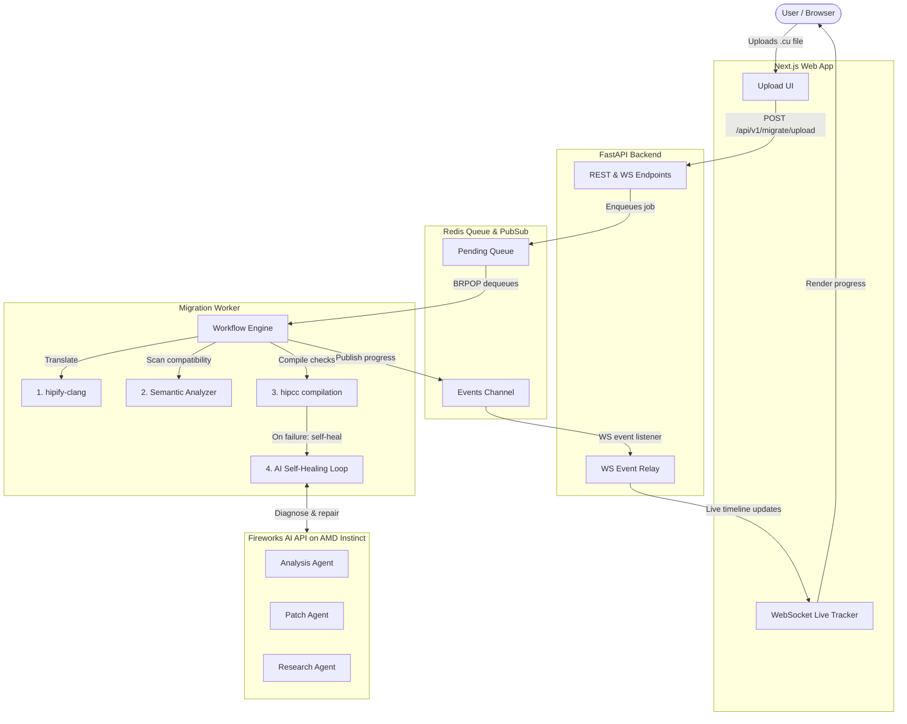

# 🚀 HIPForge: AI-Orchestrated CUDA → AMD HIP Migration

HIPForge is a self-healing, AI-orchestrated migration platform that automates the translation, compilation, and error-repair of NVIDIA CUDA GPU code to AMD HIP/ROCm code.

By combining deterministic tools (`hipify-clang`, `hipcc`) with specialized [Fireworks AI](https://fireworks.ai/) agents (Analysis, Patch, and Research), HIPForge automates the "last 30%" of migration debugging that standard compile-time translation tools leave behind.

> [!NOTE]
> **v0 Status — Compile-Validation Focus**
>
> HIPForge v0 validates that translated HIP code **compiles successfully** against the target AMD architecture.
> Runtime execution on physical AMD GPU hardware is a future validation tier and is **not** claimed by default.
> See [Honest Limitations](#honest-limitations) for details.

---

## 📚 Supporting Documentation

| Document | Description |
| :--- | :--- |
| [FRESH_MACHINE_RUNBOOK](docs/FRESH_MACHINE_RUNBOOK.md) | Zero-to-running judge guide: clone → build → health check → first migration |
| [README_DEMO](README_DEMO.md) | UI/CLI workflow walkthrough, validation confidence, and upload size thresholds |
| [DEPENDENCIES](docs/DEPENDENCIES.md) | Full dependency table, compiler modes, and sandbox configuration |

---

## ⚡ Quick Start (Docker — Recommended)

### Prerequisites

| Requirement | Notes |
| :--- | :--- |
| **Git** | To clone the repository |
| **Docker Desktop** (Windows/macOS) or **Docker Engine** (Linux) | WSL 2 backend recommended on Windows |
| **Docker Compose v2** | Included with Docker Desktop; on Linux, install the `docker-compose-plugin` |
| **Internet access** | Required on first build to pull base images (`rocm/dev-ubuntu-22.04`, `node:20-alpine`, `redis:7-alpine`) |
| **Fireworks AI API key** *(optional)* | Only required for real AI self-healing mode (`USE_MOCK_AI=false`) |

> [!TIP]
> Python 3.10+ and Node.js 20+ are only needed if you plan to run the backend or frontend **outside** Docker (bare-metal development). The Docker path requires nothing beyond Git and Docker.

### Steps

```bash
git clone https://github.com/TMXDev/Hipforge.git
cd HIPForge
cp .env.example .env             # PowerShell: Copy-Item .env.example .env
docker compose up --build -d
docker compose ps                # confirm all 4 containers are running
```

### Expected Services

| Service | URL |
| :--- | :--- |
| **Web UI** | [http://localhost:3000](http://localhost:3000) |
| **Backend API docs (Swagger)** | [http://localhost:8000/docs](http://localhost:8000/docs) |
| **Health check** | [http://localhost:8000/api/v1/health/check](http://localhost:8000/api/v1/health/check) |
| **Redis** | `localhost:4444` (mapped from container port `6379`) |

### Health Check

```bash
# Bash / Git Bash
curl http://localhost:8000/api/v1/health/check
```

```powershell
# PowerShell
Invoke-WebRequest http://localhost:8000/api/v1/health/check
```

Expected response: `{"status":"ok","redis":"connected","version":"0.1.0"}`

---

## 🔧 Environment Configuration

1. Copy the template: `cp .env.example .env`
2. Edit `.env` to set your values.

### Key Variables

| Variable | Default | Purpose |
| :--- | :--- | :--- |
| `USE_MOCK_AI` | `true` | `true` = offline mock AI (no API key needed). `false` = live Fireworks AI. |
| `USE_MOCK_COMPILER` | `true` | `true` = simulated compiler output. `false` = real `hipify-clang` / `hipcc` inside sandbox. |
| `FIREWORKS_API_KEY` | `CHANGE_ME` | Required only when `USE_MOCK_AI=false`. |
| `RUNTIME_VALIDATION_ENABLED` | `false` | Leave `false` — v0 is compile-validation only. |
| `REDIS_URL` | `redis://redis:6379` | Correct for Docker Compose networking. For bare-metal, use `redis://localhost:4444`. |
| `NEXT_PUBLIC_BACKEND_URL` | `http://localhost:8000` | Backend URL used by the frontend. |

> [!CAUTION]
> **Never commit your real `.env` file.** The `.env.example` contains safe placeholders only. Supply secrets (like `FIREWORKS_API_KEY`) locally or via CI/CD environment variables.

See [`.env.example`](.env.example) for the full list of configurable variables.

---

## 🏗️ Architecture



---

## 🔀 Mock vs Real Modes

HIPForge supports two independent toggles that control how the compiler and AI subsystems behave:

### Compiler Mode (`USE_MOCK_COMPILER`)

| Value | Behaviour |
| :--- | :--- |
| `true` *(default)* | Simulates `hipify-clang` and `hipcc` output. Useful for testing the UI, backend state machine, and workflow without ROCm tools installed. **Does not perform real compilation.** |
| `false` | Runs the real ROCm compiler toolchain inside a sandboxed Docker container (`hipforge-sandbox:latest`). Requires Docker and the sandbox image to be built. |

> [!IMPORTANT]
> Mock compiler mode is for **UI and workflow testing only**. It does not validate that translated code actually compiles against the AMD toolchain. Real compile validation requires `USE_MOCK_COMPILER=false` with `hipify-clang` and `hipcc` available inside the sandbox image.

### AI Mode (`USE_MOCK_AI`)

| Value | Behaviour |
| :--- | :--- |
| `true` *(default)* | Returns canned AI responses. No Fireworks API key or internet needed. |
| `false` | Sends compilation errors to Fireworks AI agents for real diagnosis and patch generation. Requires a valid `FIREWORKS_API_KEY`. |

### Building the Compiler Sandbox Image

To enable real compiler validation (`USE_MOCK_COMPILER=false`), build the sandbox image:

```bash
docker build -t hipforge-sandbox:latest -f Dockerfile.sandbox .
```

Verify installation:

```bash
docker run --rm hipforge-sandbox:latest hipcc --version
docker run --rm hipforge-sandbox:latest hipify-clang --version
```

---

## ⚡ AMD Compute & ROCm Proof

HIPForge demonstrates AMD compute integration through two paths:

### 1. Fireworks AI on AMD Instinct Infrastructure

All AI agent queries (analysis, patch, research) run via the [Fireworks AI Inference Platform](https://fireworks.ai/), which operates on **AMD Instinct™ GPU infrastructure** (MI300X accelerators). This means every AI-assisted repair cycle is AMD-accelerated LLM inference.

### 2. ROCm / HIP Target Compilation

HIPForge targets AMD CDNA/RDNA architectures during compile validation. Supported offload architectures include `gfx90a` (MI210/MI250), `gfx941`, and `gfx942` (MI300 series). Compilation reports record the exact compiler commands:

```bash
hipcc --offload-arch=gfx942 -c main.hip -o main.o
```

> [!NOTE]
> AMD GPU **runtime validation** (executing compiled binaries on physical AMD hardware) is disabled by default in v0 (`RUNTIME_VALIDATION_ENABLED=false`). HIPForge does not claim runtime-verified migration unless this feature is explicitly enabled and run on AMD GPU hardware.

---

## ⚠️ Honest Limitations

* **Compile-validation only (v0):** HIPForge verifies that translated HIP code builds. It does not execute binaries on AMD GPU hardware by default.
* **Runtime validation is future work:** `RUNTIME_VALIDATION_ENABLED` exists but is `false` by default.
* **No monorepo uploads:** Large CUDA repositories (e.g., the full `cuda-samples` repo) will be rejected by preflight size guards. Upload a single sample directory (e.g., `vectorAdd`) or individual `.cu` files.
* **Upload limits:** Max 20 `.cu`/`.cuh` files, 1000 total files, 50 MB extracted size, 100 MB archive size.
* **Windows host compilation:** ROCm tools (`hipcc`, `hipify-clang`) are not available natively on Windows. Use the Docker sandbox path.

---

## 🖥️ Running the Web UI (First Migration)

1. Open [http://localhost:3000](http://localhost:3000).
2. Navigate to the **Upload** page.
3. Paste a small CUDA sample or upload a `.cu` file.
4. Select a target architecture (e.g., `gfx942`).
5. Click **Start Migration**.
6. Watch the live WebSocket timeline: `PREFLIGHT` → `HIPIFY` → `COMPILING` → (optionally `ANALYZING` / `PATCHING`) → `COMPLETED`.
7. Download the translated code and report.

---

## 💻 CLI Usage

HIPForge includes a CLI at [`cli/hipforge.py`](cli/hipforge.py).

### Inside the Backend Container (no host Python needed)

```bash
docker compose exec backend python cli/hipforge.py doctor
docker compose exec backend python cli/hipforge.py migrate workspace/input/kernel.cu --output workspace/demo_out --arch gfx942 --attempts 0
```

### On the Host (requires Python 3.10+)

```powershell
$env:PYTHONPATH="backend;."
python cli/hipforge.py doctor
python cli/hipforge.py migrate workspace/input/kernel.cu --output workspace/demo_out --arch gfx942 --attempts 0
```

---

## 🧪 Running Tests

### Mock-Mode Unit Tests (no compiler or API key needed)

```powershell
$env:PYTHONPATH="backend;."
python -m pytest tests/ -q
```

### Real E2E Tests (requires running Docker containers)

```powershell
$env:PYTHONPATH="backend;."
python -m pytest -m e2e_real -s -vv
```

---

## 🔍 Troubleshooting

| Problem | Solution |
| :--- | :--- |
| Docker daemon not running | Start Docker Desktop; wait for the status indicator to turn green. |
| `docker down` not found | Use `docker compose down` (Compose v2 subcommand). |
| Backend unreachable on `localhost:8000` | Run `docker compose logs backend` to inspect startup errors. |
| Worker dies or stays offline | Run `docker compose logs migration-worker` to check worker logs. |
| Redis connection error | Run `docker compose logs redis` to verify Redis is running. |
| Upload aborted with `PROJECT_TOO_LARGE` | Extract the project locally and upload only a single sample directory containing `.cu` files. |
| Fireworks API key missing | Worker skips AI self-healing. Set `USE_MOCK_AI=true` to demo the self-healing workflow with mock responses. |
| E2E tests skipped | Verify the backend is up: `curl http://localhost:8000/api/v1/health/check`. |
| `hipcc` / `hipify-clang` not found | Build the sandbox image: `docker build -t hipforge-sandbox:latest -f Dockerfile.sandbox .` |

---

## 🛑 Shutdown

```bash
docker compose down              # stop services
docker compose down --volumes    # also wipe Redis data and workspace volumes
```

---

## 📋 Track 3 Submission Checklist

- [x] **GitHub Repository**: Public at [github.com/TMXDev/Hipforge](https://github.com/TMXDev/Hipforge).
- [x] **Safe Environment**: `.env` not committed; `.env.example` has safe placeholders.
- [x] **AMD Compute Proof**: Fireworks AI on AMD Instinct + ROCm target compilation.
- [x] **Demo Video**: Web UI / CLI migration and self-healing loop recorded.
- [x] **Quick Startup**: `docker compose up --build` verified.
- [x] **Sample Projects**: Demo uses a small test folder, not a heavy monorepo.
