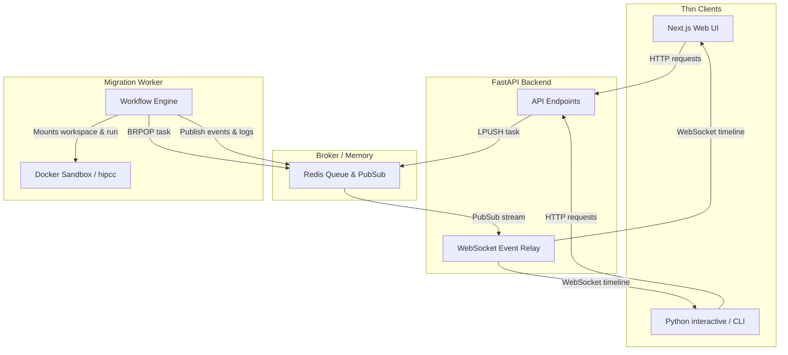

# System Architecture

HIPForge is structured around a thin client, containerized, and queue-based backend worker architecture. This design isolates web clients from expensive compilation jobs and AI self-healing tasks.

---

## 1. Subsystems Overview

---

## 2. Component Architecture

### Thin Clients (Web, CLI, API)
All user-facing clients are thin wrappers. They do not perform code translation, compilation, or AI reasoning:
- **Next.js Web UI**: Serves as the dashboard, providing code comparison editors, upload forms, and a WebSocket timeline viewer.
- **Python CLI**: Located at `cli/hipforge.py`. It runs interactive wizard setups (`/migrate`) or raw shell commands (`migrate`, `doctor`, `self-test`), communicating with the FastAPI backend via HTTP and WebSockets.

### FastAPI Backend
Coordinates API entry points, manages workspace creations on the host filesystem, pushes jobs to the Redis task queue, and relays Pub/Sub log streams to WebSockets.

### Redis Task Queue & Event Stream
Acts as the asynchronous task broker and Pub/Sub channel:
- Tasks are popped from the queue by the migration worker.
- Active migration states and compilation outputs are published to the event channel, enabling real-time terminal and dashboard updates.

### Migration Worker & Workflow Engine
Runs as a background daemon process (`python -m app.workers.migration_worker`):
- Uses a deterministic custom state machine to track migration progress.
- Instantiates a **Workflow Context** for each task containing all execution variables (e.g. migration ID, file lifecycles, and compiler outputs).
- Manages state transitions and retries up to the configured retry budget.

### Sandboxed Compiler Toolchain
When `USE_MOCK_COMPILER=false`, compile validation is offloaded to a sandboxed Docker container running `hipforge-sandbox:latest`. This container includes the AMD ROCm SDK (`hipify-clang`, `hipcc`) and the CUDA Toolkit (for header parsing compatibility).

---

## 3. Data & Status Models

### File Lifecycle Tracking
For every source file in the input directory, the workflow tracks its status in `context.file_lifecycle`:
- `converted` (bool): Whether it was translated to HIP.
- `modified_by_ai` (bool): Whether it was updated during the patching cycle.
- `compile_status` (`PASSED`, `FAILED`, `SKIPPED`, `NOT_RUN`): The file's compilation outcome.
- `original_hash` and `generated_hash`: SHA-256 signatures for tracking changes.

### Validation Confidence Ladder
Determined after compilation completes:
- **`LOW`**: hipify completed but compilation failed.
- **`MEDIUM`**: hipify and compilation succeeded; runtime validation was not performed (the default real-mode status).
- **`HIGH`**: Compile succeeded and binary output verified on AMD GPU (unsupported in v0).
- **`PROFILED`**: `HIGH` + profiling metrics collected (unsupported in v0).

### Generated Artifacts
Every migration packages its outputs into an archive file: `workspace/<migration_id>/exports/HIPForge_Migration.zip`. The ZIP includes:
- `generated/`: Translated HIP files (containing provenance comments like `// Generated by HIPForge`).
- `patches/`: Source edits produced by the Patch Agent.
- `logs/`: Sequential compile logs (`compile_attempt_*.log`).
- `reports/`: Markdown and JSON migration reports, and unified git patch diffs.

---

## 4. Durable Migration History
HIPForge maintains a durable migration history system that persists after workflows terminate:
- **Durable File Store**: Summaries are written to `workspace/history/<job_id>.json` on normal workflow completion or terminal failure.
- **No Database Dependency**: History is entirely file-backed. Redis is used solely for active live-state tracking, and no external SQL/NoSQL database is introduced.
- **On-Demand Validation**: Report and artifact availability (e.g. file existence) are checked dynamically at read time, making the API resilient to manual workspace deletions.

