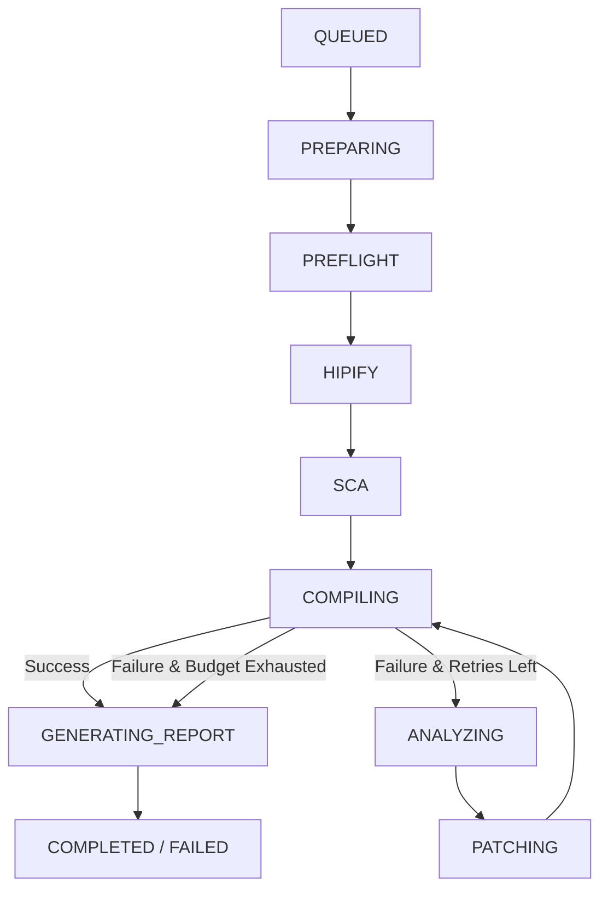

# Migration Workflow Lifecycle

This document describes the sequential pipeline executed by the HIPForge Workflow Engine for each migration job. It traces the stages from initial upload to final report packaging, detailing where metrics are recorded and how events are published.

---

## 1. Pipeline Stages

---

## 2. Phase-by-Phase Execution

### Stage 1: Queueing & Initialization (`QUEUED` & `PREPARING`)
- **Actions**: The FastAPI backend creates a workspace directory (`workspace/<migration_id>`) and enqueues the job. The migration worker dequeues the job and extracts any uploaded ZIP archives.
- **Preflight Guards**: Checks for Zip-slip path traversals or absolute path inclusions. Checks if the archive contains nested archives (`NESTED_ARCHIVE_INPUT`).

### Stage 2: Environment and Project Diagnostics (`PREFLIGHT`)
- **Actions**: Executes diagnostics to check host readiness and scan the project layout.
- **Size Guards**: Rejects the project early with `PROJECT_TOO_LARGE` if:
  - The archive exceeds `100 MB` or extraction exceeds `50 MB`.
  - The number of CUDA files exceeds `20`.
  - The total number of files exceeds `1000`.
  - A multi-project or `cuda-samples` style layout is detected.
- **Routing & Strategy**: Configures the compilation script. If multiple source files are uploaded but no Makefile or CMakeLists.txt is found, the workflow aborts with `MULTIPLE_ENTRYPOINTS` or `MISSING_BUILD_SYSTEM`. If the target architecture (e.g. `--arch`) is invalid, it fails with `UNSUPPORTED_FEATURE`.

### Stage 3: Deterministic Translation (`HIPIFY`)
- **Actions**: Iterates through source files recursively.
  - Passes CUDA source files (.cu, .cuh) to `hipify-clang` and outputs `.hip` files into the `generated/` workspace directory.
  - Copies existing HIP and C++ source files directly.
  - Modifies compiler names (`nvcc` -> `hipcc`) and file extensions in build scripts (Makefile, CMakeLists.txt).
  - Prepends provenance headers (e.g. `// Generated by HIPForge` or `// Preserved by HIPForge`) to the generated files.
- **File Lifecycle Initialization**: Each discovered file is registered in `context.file_lifecycle` with its original hash and set to `converted = false` (updated to `true` upon successful translation).
- **Post-Translation Replacements**: Executes AST and regex-based scanning to detect remaining CUDA APIs. Performs safe, deterministic search-and-replace mappings (e.g. `cudaMalloc` -> `hipMalloc`).
- **Events**: Emits `[HIPIFY] Discovered source file...` and `[HIPIFY] Successfully generated HIP file...` events.

### Stage 4: Semantic Analysis (`SCA`)
- **Actions**: Scans generated HIP files for compatibility risks (e.g. `warpSize` assumptions or texture memory usage). Writes findings to `migration_risks.json`.
- **Note**: The SCA stage is informational and does not abort the workflow.

### Stage 5: Compilation Validation (`COMPILING`)
- **Actions**: Executes `hipcc` (or runs `make` if a Makefile is present) inside the compiler sandbox. Streams compiler stdout and stderr line-by-line over WebSockets.
- **Verification & Lifecycles**: 
  - File lifecycle status for each compiled file is updated to `PASSED` or `FAILED`.
  - If compilation succeeds, it runs Semantic Post-Validation (SCA check for high-severity issues). If high-severity issues are detected, the build is overridden and marked `FAILED` with semantic errors.
  - Computes validation confidence levels (`LOW`, `MEDIUM`, `HIGH`, `PROFILED`) and logs them.
- **Post-Compile Errors / Infrastructure Check**: Classifies errors. If the error is a `TIMEOUT_ERROR` (timed out) or a `DEPENDENCY_ERROR` (e.g., missing project library headers, undefined symbol references), the workflow sets `infrastructure_error = True` and aborts directly to report generation (skipping AI repair).

### Stage 6: AI Self-Healing Loop (`ANALYZING` & `PATCHING`)
- **Trigger**: Entered if compilation fails, retries are within budget, and no infrastructure errors occurred.
- **AI Analysis**: Sends the compiler stderr and AST slices of the affected code to the Fireworks AI Analysis Agent to identify the root cause and compile a repair plan.
- **AI Patching**: The Patch Agent applies code updates to the affected files. The updated file is post-processed via `harden_hip_content` to insert launcher safety checks:
  - Pointer arguments are checked against `nullptr`.
  - Kernel sizes `N` are guarded with `N <= 0` checks.
  - Adds `hipGetLastError()` error checks and optional sync behaviors.
  - AI provenance comments are prepended: `// Generated by HIPForge (AI repaired)`.
- **Loop Prevention**: If the patch agent returns unchanged code, or the same compiler error repeats twice in a row, the engine aborts to prevent infinite loops.
- **Events**: Increments the attempt counter, updates `modified_by_ai = True` in the file lifecycle, and returns to the `COMPILING` stage.

### Stage 7: Reporting & Export Packaging (`GENERATING_REPORT` & `COMPLETE`/`FAILED`)
- **Actions**: Generates `reports/migration_report.md`, `reports/migration_report.json`, and `reports/git_patch.diff` (unified diff comparing original files against final generated files).
- **Zipping**: Packages all workspace files into `exports/HIPForge_Migration.zip`.
- **History Summary**: Writes a lightweight durable history summary JSON to `workspace/history/<job_id>.json` representing the final result of the workflow. If the workflow aborted in an early failure (e.g. `FAILED`), a minimal history summary is still written.
- **Final Status**: Transition to `COMPLETED` if final compilation succeeded, or `FAILED` if retries were exhausted or preflight checks aborted.

